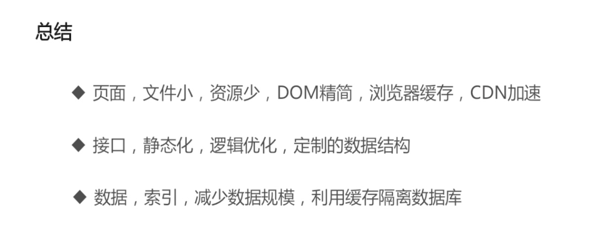

一、提高页面访问速度

二、提高秒杀接口速度（五千商品，到五W请求后界面可替换为静态界面！！！）

    \* nginx 的站点配置信息(文件不存在的时候走rewrite到动态文件)
    \* if (!-e $request\_filename) {
    \* rewrite ^([^\\.]\*)/astatus/([0-9]+)\_([0-9]+).js$ $1/astatus.php?aid=$2&gid=$3 last;
    \* }

    /astatus/1\_1.js文件

        {"error\_no":"202","error\_msg":"\\u6d3b\\u52a8\\u5546\\u54c1\\u5df2\\u4e0b\\u67b6\\u6216\\u8005\\u5df2\\u552e\\u5b8c"}

三、提高数据处理速度（减少数据规模：每次活动都新建一个订单数据表，最后再统一到大的订单数据表中）

redis与mysql的配合使用：

1⃣️：redis用哈希结构记录商品信息

2⃣️：用户下订单成功后记录用户id，活动id，商品id

3⃣️：一切判断通过后用hincrby函数自减，返回最后剩余商品数，并判断最后剩余数是否大于0

 大于等于0=》num\_left update $num

 小于0=〉设置商品状态为0，商品数量不足

4⃣️：在astatus目录下生成静态js文件，文件名以活动id\_商品id.js命名

